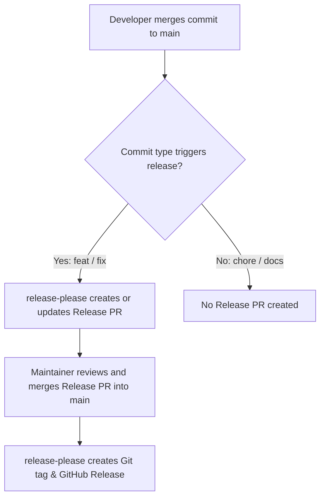

# Release Process

This document describes how releases are created and managed for the OpenWrt Ubus WiFi Presence integration.

## Automated Releases with Release Please

Releases are fully automated using [Release Please](https://github.com/googleapis/release-please-action), driven by [Conventional Commits](https://www.conventionalcommits.org/).

### Versioning Rules

Version bumps are determined by commit types since the last release:

- `feat:` — Triggers a **MINOR** version bump (e.g., `0.4.6` → `0.5.0`)
- `fix:` or `perf:` — Triggers a **PATCH** version bump (e.g., `0.4.6` → `0.4.7`)
- `BREAKING CHANGE:` or commit types with `!` (e.g., `feat!:`) — Triggers a **MAJOR** version bump
- `chore:`, `docs:`, `refactor:`, `test:`, `ci:` — Marked as hidden in changelog and do **not** trigger a new release PR on their own.

### Managed Files

When `release-please` prepares a release PR, it automatically updates:

- `.release-please-manifest.json` — The current release version manifest
- `custom_components/openwrt_ubus/manifest.json` — Integration manifest `version` property
- `CHANGELOG.md` — Release notes compiled from commit messages

## Release Workflow

### Step-by-Step Guide

1. **Push or merge commits using Conventional Commits to `main`**:
   - Ensure commit messages follow `feat:`, `fix:`, or `perf:` if a release is desired.
2. **Release PR is generated/updated**:
   - `release-please` automatically opens or updates a PR titled `chore(main): release X.Y.Z`.
3. **Review & Merge**:
   - Review the generated `CHANGELOG.md` and version updates.
   - Merge the Release PR into `main`.
4. **Automated Tag & Release Creation**:
   - Upon merging the Release PR, `release-please` tags the repository (e.g., `vX.Y.Z`) and publishes the GitHub Release.
